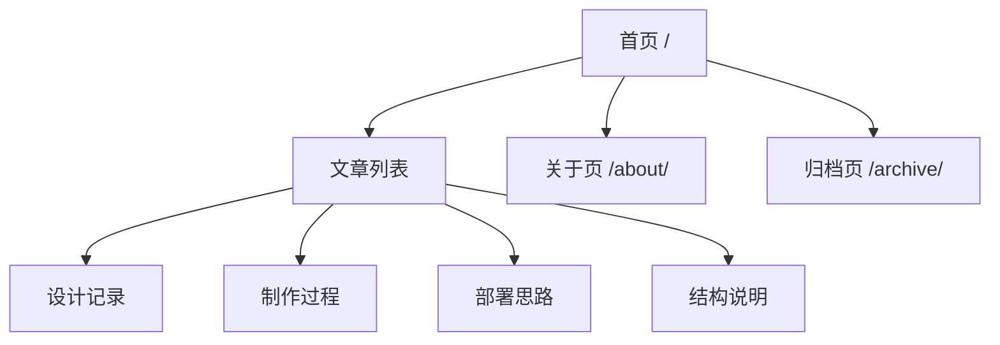

为了让这个主题站像一个完整站点，而不是一个大图展示页，页面关系被收缩成了一个更稳定的结构。

## 为什么要收缩

Mizuki 原主题默认带很多演示页：

- 番剧
- 相册
- 设备
- 技能
- 友链
- 项目

这些功能本身没问题，但放在这一版里会把主题的焦点打散。

## 当前保留的页面

### 首页

负责建立第一印象。

### 文章页

负责承接真正的内容，不让首页挤满说明性文字。

### 关于页

负责说明这套主题是怎么做的、素材来自哪里、为什么保持静态部署。

### 归档页

负责让内容不只靠首页推荐出现。

这也是更适合角色主题站的骨架。
